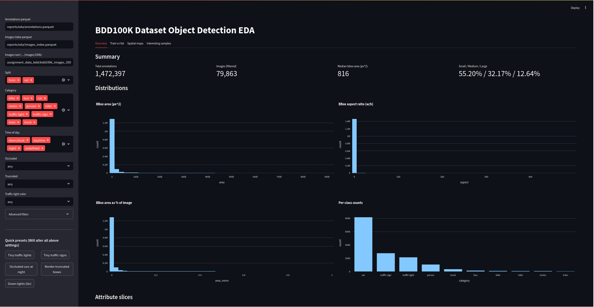
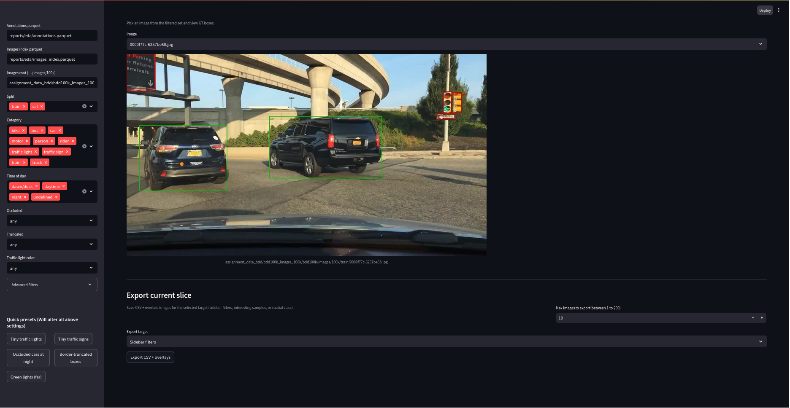
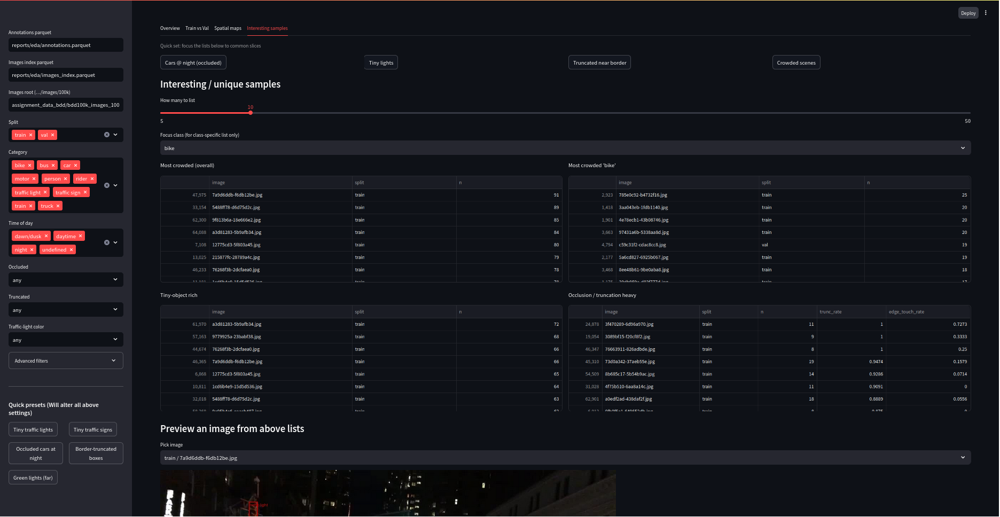

# BDD100K : Object Detection (EDA → Training → Evaluation)

End-to-end project on BDD100K:

* **Part 1: Data Analysis (EDA)** —> Streamlit dashboard (Dockerized)
* **Part 2: Model Training** —> YOLOv8 training on BDD (subset + full-data)
* **Part 3: Evaluation** —> metrics, slice analysis, and qualitative overlays


---

## Repository Layout

```
configs/
  data_bdd_yolo.yaml         # YOLO data cfg (full)
  data_bdd_yolo_subset.yaml  # YOLO data cfg (subset)
docker/                      # Dockerfile + compose entrypoint for EDA + README.md
reports/
  eda/                       # EDA analysis docs
  eval/                      # Model Evaluation analysis docs
  model/                     # Model Training analysis docs
requirements/
  data.txt                   # EDA deps
  model.txt                  # training/eval deps (torch, ultralytics etc)
scripts/
  run_data_ingest.sh         # JSON → parquet
  run_streamlit.sh           # local Streamlit
  make_subset.py             # build YOLO subset (copy/symlink)
  run_train_subset.sh        # 1-epoch subset sanity training
  run_train.sh               # full data training
  run_eval.sh                # save val predictions + plots
src/
  data/
    bdd_parser.py            # parses BDD JSON → parquet
    analyze_splits.py        # split drift/ratios
    export_yolo.py           # BDD → YOLO labels
  eval/
    match_eval.py            # slice metrics (tiny/occ/trunc)
  vis/
    streamlit_app.py         # EDA dashboard
    overlay_pred_gt.py       # GT vs Pred overlays
docker-compose.yml           # dokcer compose file for data analysis part
```

*(Heavy data is gitignored; mount via Docker or use absolute paths.)*

---

## Quick Start - Part 1: Data Analysis (Docker)

Use the containerized dashboard; dataset is mounted from host.

```bash
# 1) Edit dataset paths in docker-compose.yml (volumes:)
#    - point to .../bdd100k/images/100k and labels JSONs
# 2) Build & run
docker compose build eda
docker compose up eda      # open http://localhost:8501

# Reuse previously built parquet:
SKIP_INGEST=1 docker compose up eda
```

* Details:  **docker/README.md**
* My data analysis write-up: **reports/eda/INSIGHTS.md**


---

## Dashboard — Screenshots





---

## Part 2 - Model Training (YOLOv8)

* Docs: **reports/model/MODEL.md** (Reason to choose & architecture etc), **reports/model/TRAINING.md** (how to train)

### Minimal workflow

```bash
# 0) Env (CUDA 11.3 example)
pip install -r requirements/model.txt

# 1) Export BDD → YOLO (labels + image links)
python -m src.data.export_yolo \
  --ann reports/eda/annotations.parquet \
  --out data/yolo_bdd \
  --splits train val \
  --img_root /ABS/PATH/to/bdd100k/images/100k

# 2) Build subset and train 1 epoch (sanity)
python scripts/make_subset.py --root data/yolo_bdd --out data/yolo_bdd_subset --train_k 2000 --val_k 500 --copy
bash scripts/run_train_subset.sh    # uses yolov8s.pt, imgsz=1280, 1 epoch

#Use 'run_train.sh' for full data training.
```

---

## Part 3 - Evaluation & Visualization

* Docs: **reports/eval/EVAL.md**

```bash
# 1) Save YOLO val predictions + plots
bash scripts/run_eval.sh            # writes to runs/evaluate_subset/...

# 2) Slice metrics (tiny/occluded/truncated), tied to EDA
python -m src.eval.match_eval \
  --ann reports/eda/annotations.parquet \
  --pred_dir runs/evaluate_subset/labels \
  --out_csv reports/eval/metrics_slices.csv \
  --restrict_to_pred

# 3) Qualitative overlays (GT vs Pred)
python -m src.vis.overlay_pred_gt \
  --ann reports/eda/annotations.parquet \
  --img_root /ABS/PATH/to/bdd100k/images/100k \
  --pred_dir runs/evaluate_subset/labels \
  --out_dir reports/eval/qual --max_images 20 \
  --restrict_to_pred --conf_min 0.25
```

---

## Notes

* EDA shows **tiny-object dominance** for `traffic light/sign`; evaluation tracks this via **AP\_small** and **small-object recall proxy**.
* Use `imgsz 1280–1536`, `rect=True`, and NMS IoU 0.55–0.65 for tiny objects; see **TRAINING.md** and **EVAL.md** for exact flags.
* All paths are configurable; prefer **absolute** paths for image roots when outside Docker.
