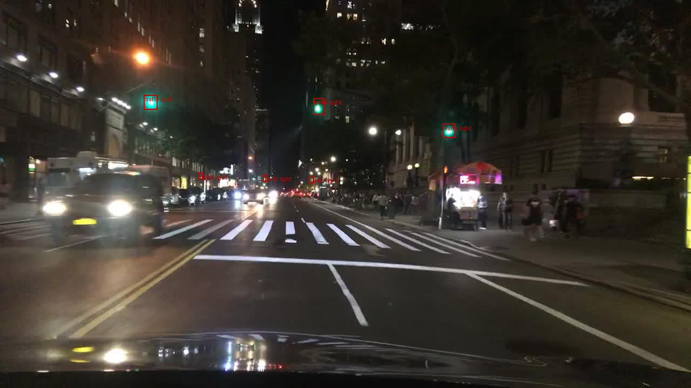

# BDD100K — Data Analysis Insights For Object Detection

This document summarizes my overall analysis of the BDD100K dataset for the object detection task primarily. It includes the train/val distribution analysis, potential drifts, spatial patterns, and interesting/unique samples observed via the Streamlit dashboard (`src/vis/streamlit_app.py`) I have built. Each section includes a short takeaway, what it means for our object detection and classification modeling.

---

## 1) Class imbalance & split drift (using `count_ratio_train_val`)

**Takeaway:** Per-class train/val count ratios cluster tightly around the global split multiplier (~7:1), so there is **no class-frequency drift** across splits. One outlier is the rare class `train` at ~9.07× - this is likely due to low absolute counts (high variance), not systematic sampling bias.

**Numbers (from my Streamlit “Train vs Val” table).**
- Ratio range across 10 classes: **6.64 → 9.07** (median ≈ **6.96**).
- Outlier: **`train` ≈ 9.07×** (rare class; treat metrics with caution).

**Relevance in training and evaluation:**
- Because all classes scale similarly from train→val, don’t expect class-frequency alone to drive evaluation gaps.
- Low-support classes (e.g., `train` class) can show noisy per-class AP; we should present counts alongside metrics.
- Report **per-class AP with support** (number of val boxes). Flag any class with very low support (e.g., `<50` boxes).
- Include both **micro** (overall) and **macro** (per-class averaged) metrics to show robustness to long-tail effects.
- Keep drift checks focused on **quality attributes** (small-object rate, occlusion, truncation, spatial bias), where real shifts usually hide.

**Outputs I used for above analysis:**


CSV: [`insights/class_split_compare.csv`](insights/class_split_compare.csv)


### Small-object, Occlusion, and Truncation Drift 
#### `Using small_rate_delta`, `occluded_rate_delta`, `truncated_rate_delta`:


**Takeaway:** Across 9 of 10 classes, train↔val deltas are small (small-rate within ~±1.7%, occlusion within ~±2%, truncation within ~±1.6%).  
One apparent outlier is class **`train`** (small_rate Δ≈+29.4%, occluded Δ≈−27.8%, truncated Δ≈−5.4%), but this class has **very low support** (train=136, val=15), so the deltas are **not reliable**.

**Why it matters:** With no substantive drift, we don’t expect split-induced shifts to dominate evaluation. Any performance gaps are more likely due to inherent task difficulty (e.g., tiny traffic lights) rather than distribution mismatch.

**Action:**
- Report **per-class AP with support**; flag classes with low counts (e.g., `train`) as **low-confidence**.
- Optional: use **micro + macro** metrics in the eval section to show robustness to the long-tail.
- Keep attention on **tiny-object handling** and **qualitative failure modes**.


**How to reproduce above outputs in the app:**
1. Open Streamlit (`./scripts/run_streamlit.sh`), go to **Train vs Val** tab.
2. Clear special filters (keep all splits/categories).
3. Review the **Counts by class & split** chart and the **delta table**.  
4. Click **Download split compare CSV** and save it to `reports/eda/insights/class_split_compare.csv`.


---

## 2) Small-object prevalence & drift


**Insight:** `traffic light` is overwhelmingly tiny — **88.3% small** (median **262 px² ≈ 0.03%** of a 1280×720 frame). `traffic sign` is also small-object heavy — **74.9% small** (median **444 px² ≈ 0.05%**). Split deltas are negligible → this is a **core tiny-object challenge**, not a train/val mismatch.

**Impact:** Train/eval with higher input res (≥ **960**), use small-object augs (mosaic/copy-paste), verify **stride-8** coverage/anchors, and track **AP_small** for lights/signs.

*YOLOv8 tiny-object preset(We will use parameter values on similar lines to tackle tiny objects while training):* `imgsz=1280 mosaic=1.0 copy_paste=0.5 mixup=0.0 scale=0.5 translate=0.1 fliplr=0.5 flipud=0.0` (track **AP_small** for lights/signs).


**Some examples of Tiny lights and signs:**



---

## 3) Occlusion & truncation patterns


**Insight.** Absolute rates are high for **rider/motor** (occlusion ≈0.75–0.90) and truncation is highest for **bus/train/truck** (≈0.15–0.33) in both splits; patterns are consistent. 
No material drift overall. Largest deltas (excluding low-support `train`):  
- **Occlusion:** `bike` **−4.27%** (val more occluded) — borderline, worth monitoring.  
- **Truncation:** `motor` **−1.56%** — minor. Others ≈ ±1% or less.

**Impact.** Use robustness augs; monitor slice metrics.  
*YOLOv8 knobs:* `imgsz=1280 mosaic=1.0 copy_paste=0.5 translate=0.2 scale=0.5 perspective=0.01 mixup=0.1`  
Track AP/Recall on **occluded=true** and **edge_touch=true** slices; keep **NMS IoU≈0.6** and review FNs in these slices.


---

## 4) Interesting / unique samples

**Crowded scenes** — many overlapping objects; stress-test NMS and recall.  
   
CSV: [`reports/eda/insights/crowded.csv`](insights/crowded.csv)

**Tiny traffic lights** — (examples given above as well) extreme small objects; expect precision/recall drops.  
   
CSV: [`reports/eda/insights/tiny_traffic_lights.csv`](insights/tiny_traffic_lights.csv)

**Tiny traffic signs** — (examples given above) small text/symbols; sensitive to blur/resolution.  
   
CSV: [`reports/eda/insights/tiny_traffic_signs.csv`](insights/tiny_traffic_signs.csv)

**Occluded cars at night** — glare/occlusion; monitor recall on this slice.  
   
CSV: [`reports/eda/insights/occluded_cars_night.csv`](insights/occluded_cars_night.csv)

**Border-truncated** — boxes touching edges; prone to FNs/low scores.  
   
CSV: [`reports/eda/insights/border_truncated.csv`](insights/border_truncated.csv)

**Special steps to be taken during Object Detection Training:**  
- Use **imgsz ≥ 960–1280**, `mosaic=1.0`, `copy_paste=0.5`; enable **stride-8** coverage.  
- Monitor **AP_small**, **Recall** on `occluded=true` and `edge_touch=true` subsets.  
- Review failures from these buckets post-eval; adjust **conf/NMS IoU** and augs accordingly.

---

## Appendix — How to run the dashboard and visualise above insights:

```bash
pip install -r requirements/data.txt
./scripts/run_data_ingest.sh   # builds parquet from BDD JSON + images
./scripts/run_streamlit.sh     # launches dashboard on :8501
